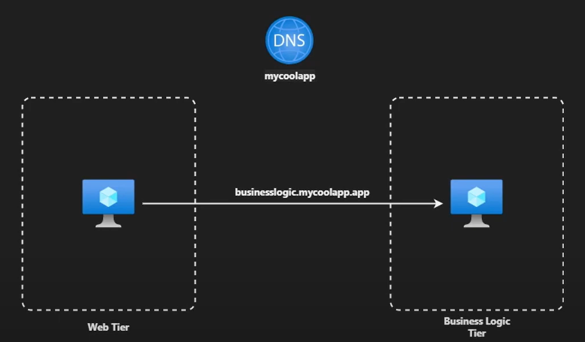

# Introduction
This notebook is a simple tutorial that presents Azure Private DNS Zone, and is available on [YouTube](https://www.youtube.com/watch?v=Bs21oLvjw5c). The script is available on [GitHub](https://github.com/KamalRathnayake/MeetKamalToday./blob/main/47_PrivateDNS/script.ps1).

The end solution is going to look like this:




# Steps

## Deploy architecture
Execute following script:
```bash
resource_group="rg-lab-az-104"
location="westeurope"
vnetName="MyCoolAppVNET"
subnetName="WebTier"
subnetName2="BusinessLogicTier"
vmName="WebVM"
vmName2="BusinessLogicVM"

# Create Resource Group (optional)
#az group create --name $resource_group --location $location

# Create Virtual Network
az network vnet create --address-prefixes 10.0.0.0/16 --name $vnetName --resource-group $resource_group

# Create Subnets
az network vnet subnet create \
    --resource-group $resource_group \
    --vnet-name $vnetName \
    -n $subnetName \
    --address-prefixes 10.0.0.0/24

az network vnet subnet create \
    --resource-group $resource_group \
    --vnet-name $vnetName \
    -n $subnetName2 \
    --address-prefixes 10.0.10.0/24

# Create VM in each subnet
az vm create \
    --resource-group $resource_group \
    --name $vmName \
    --image ubuntults \
    --vnet-name $vnetName \
    --subnet $subnetName \
    --admin-username azureuser \
    --admin-password Hello@12345#

az vm create \
    --resource-group $resource_group \
    --name $vmName2 \
    --image ubuntults \
    --vnet-name $vnetName \
    --subnet $subnetName2 \
    --admin-username azureuser \
    --admin-password Hello@12345#
```

## Install simple web server
First of all, log in to the BusinessLogicVM:
```bash
ssh azureuser@<ip_address>
```

Then, install dependencies and create basic web page:
```bash
sudo su
apt-get update -y
apt-get upgrade -y
apt-get install apache2 -y

echo "Hello Business Logic VM!" > /var/www/html/index.html
```

## Check connection WebVM -> BusinessLogicVM
First of all, log in to the WebVM:
```bash
ssh azureuser@<ip_address>
```

Ping the BusinessLogicVM using NICPrivateIP:
```bash
ping 10.0.10.4
```

The expected output is:
```
azureuser@WebVM:~$ ping 10.0.10.4
PING 10.0.10.4 (10.0.10.4) 56(84) bytes of data.
64 bytes from 10.0.10.4: icmp_seq=1 ttl=64 time=0.874 ms
64 bytes from 10.0.10.4: icmp_seq=2 ttl=64 time=1.00 ms
64 bytes from 10.0.10.4: icmp_seq=3 ttl=64 time=0.994 ms
64 bytes from 10.0.10.4: icmp_seq=4 ttl=64 time=0.920 ms
```

Ping the BusinessLogicVM using Public IP:
```bash
ping <ip_address>
```

Expected output is:
```bash
azureuser@WebVM:~$ ping 20.224.94.185 
PING 20.224.94.185 (20.224.94.185) 56(84) bytes of data.
64 bytes from 20.224.94.185: icmp_seq=1 ttl=57 time=1.40 ms
64 bytes from 20.224.94.185: icmp_seq=2 ttl=57 time=1.28 ms
```

WebVM can access BusinessLogicVM without any problem.

We can also curl using private IP:
```
azureuser@WebVM:~$ curl 10.0.10.4
Hello Business Logic VM!
```

Curl using public IP is not possible as inbound traffic is denied by the BusinessLogicVMNSG Network Security Group. However we can add inbound port rule to allow traffic for HTTP and then curl should return proper content:
```
azureuser@WebVM:~$ curl http://20.224.94.185
Hello Business Logic VM!
```

Let's try to access the server using domain name:
```
azureuser@WebVM:~$ curl http://businesslogic.mycoolapp.app
curl: (6) Could not resolve host: businesslogic.mycoolapp.app
```
Off course, it's not possible as there is no DNS server that could translate domain name into IP address.

## Create Private DNS Zone 
In Azure Portal, create manually an instance of Private DNS Zone and name it `mycoolapp.app`. Next, link virtual network to this private DNS Zone.

We cannot still resolve the domain name as there is no DNS record to translate domain name into IP address. We need to create it - such record should be named `businesslogic` and IP address should contain private IP address.

Now we can curl the server using domain name:
```
azureuser@WebVM:~$ curl http://businesslogic.mycoolapp.app
Hello Business Logic VM!
```